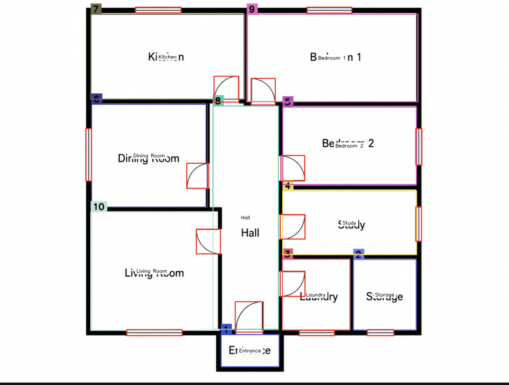

# Floor Plan Detection and Analysis

This project is a Python-based floor plan analysis pipeline developed as part of a master’s thesis project.

The system takes one or more floor plan images and converts them into structured information by detecting:

- Rooms
- Room names
- Doors
- Windows
- Additional openings between rooms
- Basic room connectivity
- Basic floor plan constraints

The project currently runs locally from the command line. It does not require a graphical user interface, web server, Docker container, or external API.

---

## Project Goal

The purpose of the project is to transform an unstructured floor plan image into a structured representation that can later be used for:

- Floor plan validation
- Room adjacency analysis
- Accessibility and circulation analysis
- Constraint checking
- Mathematical optimization
- Automatic improvement of floor plan layouts
- Future user-interface visualization

The current version focuses on detection and analysis. It does not yet automatically redesign or optimize the floor plan.

---

## Processing Pipeline

The program processes every floor plan through the following pipeline:

```text
Floor plan image
        ↓
Cascade R-CNN room detection
        ↓
OCR room-name recognition
        ↓
Room polygon creation and cleanup
        ↓
YOLO door and window detection
        ↓
Door-to-room connection analysis
        ↓
Wall-mask extraction
        ↓
Additional opening detection
        ↓
Basic floor plan validation
        ↓
Annotated image and text report
```

---

## Main Technologies

- Python
- OpenCV
- PyTorch
- MMDetection
- MMEngine
- MMCV
- Cascade R-CNN
- Ultralytics YOLO
- Tesseract OCR
- Pytesseract
- Shapely
- NumPy

---

## Main Features

### Room Detection

A trained Cascade R-CNN model detects room regions in the floor plan.

The detector returns:

- Room bounding boxes
- Confidence values
- Room IDs
- Wall detections
- Room detections

The default room confidence threshold is `0.40`.

### Room Name Recognition

Tesseract OCR reads room labels such as:

- Kitchen
- Bathroom
- Bedroom
- Living Room
- Hall
- Storage

The detected text is assigned to a room when the center of the text box is located inside the room polygon.

### Polygon Processing

Detected room boxes are converted into Shapely polygons.

The code then attempts to:

- Remove polygons contained inside other polygons
- Reduce overlapping room areas
- Keep the largest valid polygon when necessary
- Calculate room centroids
- Assign unique room IDs

### Door and Window Detection

A trained YOLO model detects architectural objects such as:

- Doors
- Windows
- Sliding doors
- Walls
- Staircases
- Columns
- Railings

The main pipeline primarily uses the model for door and window detection.

### Room Connectivity

Every detected door is compared with the detected room polygons.

The program finds the nearest valid rooms and creates a connection such as:

```text
Door 1 connects Kitchen and Living Room
```

This creates the foundation for a room-connectivity graph.

### Additional Opening Detection

Not every connection between rooms contains a normal door symbol.

The opening detector searches for wall gaps that may represent:

- Open doorways
- Large passages
- Open-plan transitions
- Missing wall sections between connected rooms

Known doors and windows are excluded so they are not counted twice.

### Basic Floor Plan Validation

The validation module checks basic prototype requirements, including:

- At least one detected room
- At least one bathroom
- At least one kitchen or cooking area
- Required connections based on the current implementation

This is only prototype validation.

A result of `True` means that the floor plan satisfies the constraints currently implemented in the code. It does not mean that the floor plan fully complies with TEK17 or other building regulations.

---

## Project Structure

```text
ProjectMaster/
│
├── main.py
├── requirements.txt
├── install_openmmlab.sh
│
│
├── detections/
│   ├── room_detection.py
│   ├── objectDetect.py
│   ├── openingDetect.py
│   └── openingDetect_new.py
│
├── configs/
│   ├── room.py
│   ├── door.py
│   ├── floorPlan.py
│   ├── helper.py
│   ├── keep_only_thick_lines.py
│   └── mmdet_ImageToJson.py
│
├── weights/
│   ├── best.pt
│   ├── cascade_swin_latest.pth
```

Some file names may differ slightly depending on the version of the project.

---

## Model Weights

The trained model weights are not included directly in the repository because they may be too large for normal GitHub storage.

Download the model weights here:

**[Download the model weights](PASTE_WEIGHTS_DOWNLOAD_LINK_HERE)**

After downloading them, place the files in the following locations:

```text
ProjectMaster/
└── weights/
    ├── best.pt
    ├── cascade_swin_latest.pth
    
```

---

## Requirements

Recommended environment:

- Python 3.10
- macOS, Linux, or Windows
- At least 8 GB RAM
- More memory is recommended for large floor plan images
- CUDA-compatible GPU is optional

The project can run on CPU. GPU acceleration is used only when CUDA is available and correctly configured.

---

## Installation

### 1. Clone the Repository

```bash
git clone https://github.com/Abdu299/ProjectMaster.git
cd ProjectMaster
```

### 2. Create a Virtual Environment

macOS or Linux:

```bash
python3 -m venv venvy
source venvy/bin/activate
```

Windows PowerShell:

```powershell
python -m venv venvy
venvy\Scripts\Activate.ps1
```

When the environment is active, the terminal should display something similar to:

```text
(venvy)
```

### 3. Upgrade pip

```bash
python -m pip install --upgrade pip
```

### 4. Install Standard Dependencies

```bash
pip install -r requirements.txt
```

### 5. Install OpenMMLab Dependencies

The repository contains an installation script for the MMDetection environment:

```bash
chmod +x install_openmmlab.sh
./install_openmmlab.sh
```

If the script is not available or does not work in your environment, install OpenMMLab manually:

```bash
pip install -U openmim
mim install mmengine
mim install mmcv
pip install mmdet
```

MMCV, MMDetection, PyTorch, and Python versions must be compatible. Use the versions defined by the project whenever possible.

### 6. Install Tesseract OCR

Pytesseract is only the Python wrapper. The Tesseract program must also be installed on the computer.

macOS:

```bash
brew install tesseract
```

Ubuntu or Debian:

```bash
sudo apt update
sudo apt install tesseract-ocr
```

Windows:

Install Tesseract and make sure its installation directory is added to the system `PATH`.

Verify the installation:

```bash
tesseract --version
```

### 7. Add the Model Weights

Download the weights from the link in the **Model Weights** section and verify that these files exist:

```bash
ls weights
```

Expected output should include:

```text
best.pt
cascade_swin_latest.pth
zode_mmdetection_config
```

---

## How to Use

### 1. Add Floor Plan Images

Make a file and name it :

```text
images/
```
and place the floor plan images inside it


Supported formats:

- `.png`
- `.jpg`
- `.jpeg`
- `.webp`

Example:

```text
images/apartment_1.png
images/apartment_2.jpg
```

### 2. Run the Complete Pipeline

From the project root, run:

```bash
python main.py
```

The program will process every supported image inside `images/`.

### 3. View the Results

Annotated images and reports are saved in:

```text
results/
```

Wall masks are saved in:

```text
walls_results/
```

On macOS, the folders can be opened with:

```bash
open results
open walls_results
```

---

## Output Files

For an input image named:

```text
images/apartment_1.png
```

the program may generate:

```text
results/apartment_1.png
results/apartment_1.txt
walls_results/apartment_1_walls.png
```

### Annotated Image

The annotated image can contain:

- Room polygons
- Room IDs
- OCR room labels
- Door boxes
- Window boxes
- Additional opening boxes

Example:



### Text Report

The text report contains structured information similar to:

```text
Image: apartment_1.png
========================================

Is the floor Plan valid:
True

Rooms detected:
Room id: 1, text: Kitchen, centroid: (250.4, 311.2)
Room id: 2, text: Living Room, centroid: (510.8, 322.1)

Doors detected:
Door 1 connects room Kitchen with id 1 and room Living Room with id 2

Windows detected:
Window 1: bbox=(100, 40, 180, 60)

Openings detected:
Opening 1 connects room Kitchen with id 1 and room Living Room with id 2
```

---

## Test Only the Cascade Room Detector

To test the Cascade R-CNN model without running the complete pipeline:

```bash
python mmdet_cascade_local.py images/apartment_1.png \
  --conf 0.4 \
  --out cascade_result.json
```

This produces a JSON file containing detected rooms and walls.

Example structure:

```json
{
  "type": "floor_plan",
  "model": "cascade_rcnn",
  "device": "cpu",
  "confidence_threshold": 0.4,
  "detectionResults": {
    "walls": [],
    "rooms": []
  }
}
```

This test is useful for determining whether a problem comes from:

- Cascade room detection
- OCR
- YOLO detection
- Door-to-room matching
- Opening detection
- Validation logic

---

## Configuration

### Room Detection Confidence

The default room confidence is normally defined in the room-detection class:

```python
room_conf = 0.4
detection_conf = 0.4
```

A higher value:

- Produces fewer detections
- Reduces low-confidence false positives
- May miss valid rooms

A lower value:

- Produces more detections
- May find difficult rooms
- Can increase false positives

### YOLO Confidence

The main pipeline normally uses:

```python
0.3
```

for door and window detection.

### Wall Extraction

Example wall-mask settings:

```python
threshold_value=120
min_thickness=8
min_area=500
min_length=40
```

### Opening Detection

Example opening settings:

```python
min_opening_len=25
max_opening_len=180
wall_strip=10
corner_margin=12
support_len=10
exclude_distance=10
room_connect_distance=5
duplicate_distance=10
```

These values may need adjustment for images with different resolutions, wall thicknesses, or drawing styles.

---

## Important Implementation Note

The `keep_only_thick_lines()` function must return the generated wall mask if `main.py` passes its result directly to the opening detector.

The function should end with:

```python
cv2.imwrite(output_path, cleaned)
print(f"Saved result to: {output_path}")

return cleaned
```

Without `return cleaned`, the variable receiving the wall mask will be `None`, and opening detection may fail.

---

## Performance

The Cascade R-CNN model is large and may take time to load, especially on CPU.

For better performance, create the room detector once before processing all images:

```python
room_detector = imageToRooms()

for file in os.listdir(folder_name):
    rooms, img_print = room_detector.returnRoom(path)
```

Avoid creating a new `imageToRooms()` object for every image because this may reload the model repeatedly.

---

## Troubleshooting


### `FileNotFoundError: best.pt`

The YOLO model is missing.

Verify:

```bash
ls weights/best.pt
```

### Config File Not Found

Verify:

```bash
ls weights/zode_mmdetection_config/cascade_swin_local.py
```

### `tesseract is not installed`

Install Tesseract and verify:

```bash
tesseract --version
```

### No Room Names Are Detected

Possible causes:

- The text is too small
- The image resolution is low
- Room labels use unusual fonts
- OCR filtering removes short labels
- The floor plan contains rotated text

Try using a higher-resolution image.

### `Loading Cascade model on cpu`

This is normal when CUDA is not available.

CPU processing is slower but supported.

### Opening Detection Receives `None`

Make sure `keep_only_thick_lines()` returns the cleaned wall mask:

```python
return cleaned
```

### Too Many False Room Detections

Increase:

```python
room_conf = 0.5
```

or higher.

### Valid Rooms Are Missing

Reduce the room confidence slightly:

```python
room_conf = 0.3
```

Use small changes and compare the results.

---

## Current Limitations

The current project has several limitations:

- Room geometry is initially based on detected bounding boxes
- OCR may fail on small, rotated, or unclear labels
- Short labels such as `WC`, `K`, or `BA` may be filtered out
- Door-to-room matching is based mainly on geometric distance
- Opening detection depends on wall quality and image resolution
- Different floor plan drawing styles may require different thresholds
- Detection errors can affect later validation results
- The current validation is not full TEK17 compliance checking
- The project does not yet automatically optimize or redesign layouts
- The project does not yet include a graphical user interface

---

## Future Development

Planned or possible future improvements include:

- Graphical user interface
- Drag-and-drop floor plan upload
- Interactive correction of detected rooms
- Editable room names and boundaries
- Visualization of room connections
- REST API
- More reliable OCR
- Polygon-based segmentation instead of rectangular room boxes
- TEK17-related constraint modules
- Accessibility analysis
- Emergency-exit analysis
- Mathematical floor plan optimization
- Comparison of original and optimized layouts
- Export to JSON
- Export to CAD- or BIM-compatible formats

---

## Research Context

This project is intended as a research prototype.

Its main research direction is to combine:

1. Computer vision
2. OCR
3. Geometric analysis
4. Constraint validation
5. Floor plan optimization

The detection pipeline transforms floor plan images into structured room and connectivity data. This structured data can then be used as input for mathematical models and optimization algorithms.

---

## Disclaimer

This software is a research prototype.

The detected results may contain errors and should not be used as the only basis for architectural, construction, safety, accessibility, or legal decisions.

A floor plan marked as valid only satisfies the prototype rules implemented in the current code.

---

## Author

Developed as part of a master’s thesis project in Programming and System Architecture.

