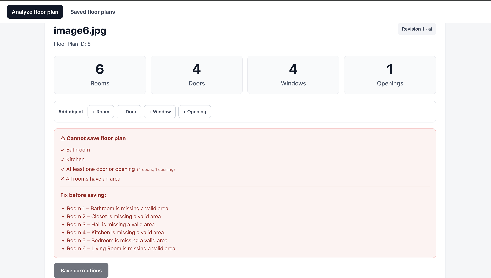
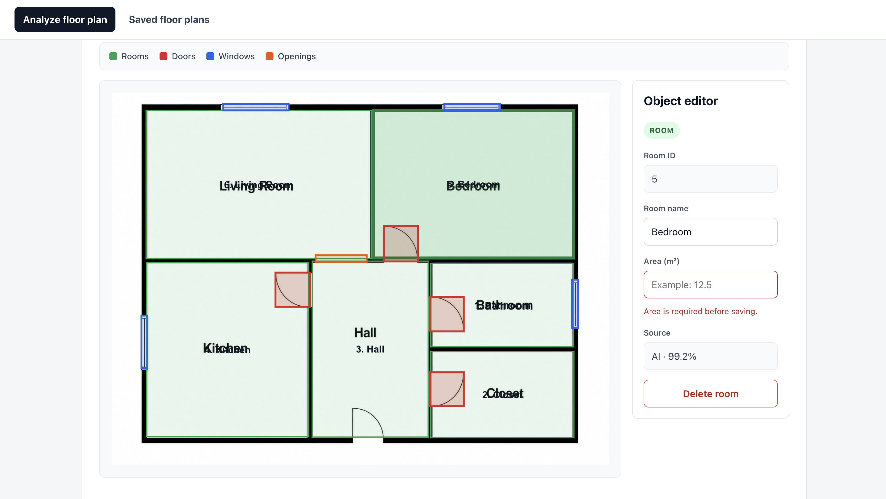
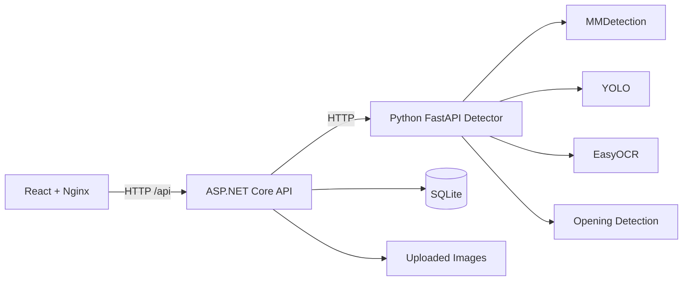

# Floor Plan Analysis System

A full-stack research prototype for **automated floor-plan analysis, correction, validation, and persistence**.

The system accepts a floor-plan image, detects rooms and architectural objects, extracts room names with OCR, stores the result as an immutable AI revision, and lets the user correct the detected geometry and metadata in a web interface. Corrected versions are stored as new revisions instead of overwriting the original AI result.

> This project is a research prototype. Its validation rules are project-specific and are **not a complete TEK17/building-code compliance check**.

## What This Project Is

This project is a **human-in-the-loop floor-plan digitization and analysis system**. It takes a normal floor-plan image and converts it into structured, editable data instead of leaving the plan as only a picture. The detection pipeline identifies rooms, room names, doors, windows, and openings, while the web application lets a user review the result and correct mistakes before saving it.

The goal is not to replace an architect or produce a legally approved building plan. The goal is to create a reliable digital representation of an existing floor plan that can later be used for **validation, measurement, data analysis, and floor-plan optimization**.

## Why It Is Useful

Floor plans often exist as images or PDFs that are difficult for software to reason about directly. Manually converting them into structured data is slow and error-prone. This system automates much of that work while still keeping a person in control of the final result.

It is useful because it can:

- **Reduce manual work** by automatically detecting important floor-plan elements.
- **Combine AI with human correction**, so detection mistakes can be fixed before the data is trusted.
- **Create structured geometry and room data** that other software can use instead of working directly with pixels.
- **Preserve revision history**, keeping the original AI result separate from later user corrections.
- **Support future optimization and rule checking**, because corrected rooms, connections, areas, and geometry are stored in a consistent form.
- **Provide a reproducible research platform** through a clear React + ASP.NET Core + Python architecture and Docker-based setup.

A typical workflow is:

```text
Floor-plan image
      ↓
Automatic AI / image analysis
      ↓
Structured rooms + doors + windows + openings
      ↓
User reviews and corrects the result
      ↓
Validated revision saved to the database
      ↓
Data can later be used for analysis or optimization
```

## Screenshots

### Detection result



### Interactive correction interface




## Main Features

- Upload floor-plan images from the browser.
- Detect rooms using an MMDetection / Cascade R-CNN model.
- Read room labels using EasyOCR.
- Detect doors and windows using YOLO.
- Detect additional openings using rule-based image processing.
- Visualize detections in React with `react-konva`.
- Move, rename, add, and delete detected objects.
- Enter real room areas in m².
- Store the AI result as **Revision 1** and user corrections as **Revision 2+**.
- Save floor plans, revisions, geometry, measurements, and validation results in SQLite.
- Reopen and continue working with previously saved floor plans.
- Run the complete system with Docker Compose.

## Floor-Plan Input Expectations

The application is designed for **2D architectural floor-plan images**. Detection works best when the drawing follows a clear, conventional floor-plan style.

For the best results, the input should preferably have:

- **Walls shown as thick, dark/black lines** with good contrast against a light background.
- **Rooms enclosed by visible wall boundaries** so the room detector can separate spaces.
- **Room names written inside the rooms**, for example `Kitchen`, `Bathroom`, `Bedroom`, or `Living Room`. Clear horizontal text and good image resolution improve OCR accuracy.
- **Doors shown with recognizable architectural door symbols**, typically a wall opening with a door leaf and/or swing arc.
- **Windows shown as recognizable window symbols in the wall**, such as narrow rectangular or parallel-line window markings.
- **Open passages clearly visible as gaps between wall segments** when there is no normal door symbol.
- A reasonably clean image with limited noise, annotations, or overlapping text.

Supported upload formats in the web interface are:

```text
.png
.jpg
.jpeg
.webp
```

These are **input expectations, not legal building requirements**. Different drawing styles, very thin walls, low-resolution scans, unusual symbols, rotated text, or unclear room labels can reduce detection accuracy.

## Functional Constraints and Warnings

After detection, the application performs live validation. A floor plan is considered valid by the current prototype when it has:

- At least **one detected room**.
- At least **one bathroom**.
- At least **one kitchen or cooking area**.
- At least **one connection**, represented by either a **door OR an opening**.

Before a corrected revision can be saved, **every room must also have a positive real-world area in m²**.

The interface therefore warns the user when something important is missing, for example:

```text
✕ Bathroom
✕ Kitchen
✓ At least one door or opening
✕ All rooms have an area
```

It also gives more specific messages such as:

```text
No bathroom was found.
No kitchen or cooking area was found.
The floor plan needs at least one door or one opening.
Room 3 – Bathroom is missing a valid area.
```

The purpose of these warnings is to make the user review and correct the AI output before saving it as a trusted revision. These constraints are **project-specific prototype rules** and are not a complete TEK17 or building-code validation system.

## What the Application Lets You Do

The web application is not only a detector. It also provides a correction and review workflow around the AI result.

A user can:

- **Upload and analyze** a floor-plan image.
- See detected **rooms, doors, windows, and openings** overlaid on the original drawing.
- See AI confidence information for detected elements.
- **Select and move** detected objects when the geometry is slightly wrong.
- **Rename rooms** when OCR reads the room label incorrectly.
- **Add new rooms, doors, windows, or openings** by drawing them directly on the floor plan.
- **Delete incorrect detections**.
- Change which rooms a detected or manually added **door/opening connects**.
- Enter the **real room area in m²** for every room.
- See live validation showing what still needs to be corrected before saving.
- Save corrections as a **new revision** instead of overwriting the original AI result.
- Keep the original AI analysis as **Revision 1** and later user changes as **Revision 2, Revision 3, ...**.
- Open the **Saved floor plans** page and return to previously analyzed floor plans.
- Continue editing previously saved floor plans.
- Delete saved floor plans when they are no longer needed.
- Persist the SQLite database and uploaded images when the system is run with Docker volumes.

This creates a **human-in-the-loop workflow**:

```text
Upload image
    ↓
AI detection
    ↓
Review detected objects
    ↓
Correct names / geometry / connections
    ↓
Add missing objects
    ↓
Enter room areas
    ↓
Resolve validation warnings
    ↓
Save a new revision
```

## Architecture



### Frontend — `FloorPlan.Web`

Built with **React, TypeScript, Vite, React Router, and react-konva**. It handles image upload, visualization, editing, live validation, saved floor plans, and revision correction.

### Backend — `FloorPlan.Api`

Built with **ASP.NET Core Web API, C#, Entity Framework Core, and SQLite**. It is the central application layer. It receives requests from React, calls the Python detector, validates corrected data, manages revisions, and persists floor plans and uploaded images.

### Detection service — `ProjectMaster`

Built with **Python and FastAPI**. It combines several detection methods:

- **MMDetection / Cascade R-CNN** — room detection.
- **EasyOCR** — room-name recognition.
- **YOLO** — door and window detection.
- **OpenCV / geometric rules** — opening detection and floor-plan processing.

The detector returns structured JSON to the ASP.NET API.

## Data and Revision Model

Geometry is stored in **original image pixel coordinates** so the same data can be rendered consistently regardless of browser size.

The AI result is preserved as the first revision:

```text
Revision 1  -> source: ai
Revision 2  -> source: user, based on Revision 1
Revision 3  -> source: user, based on Revision 2
...
```

Previous revisions are not overwritten.

The current prototype considers a floor plan semantically valid when it contains:

- at least one room;
- at least one bathroom;
- at least one kitchen/cooking area;
- at least one **door OR opening**.

To save a corrected revision, every room must also have a valid positive area in m².

## Project Structure

```text
FLOOR_PLAN_APP/
├── compose.yaml
│
├── ProjectMaster/
│   ├── api.py
│   ├── Dockerfile
│   ├── requirements.txt
│   ├── install_openmmlab.sh
│   ├── configs/
│   ├── detections/
│   └── weights/
│
└── FloorPlanSystem/
    ├── FloorPlan.Api/
    │   ├── Controllers/
    │   ├── Data/
    │   ├── Models/
    │   ├── Services/
    │   ├── Migrations/
    │   └── Dockerfile
    │
    └── FloorPlan.Web/
        ├── src/
        ├── Dockerfile
        └── nginx.conf
```

## Model Weights

The Python detector requires trained model weights before detection can run. Make sure the required files are available in `ProjectMaster/weights/`, including:

```text
best.pt
cascade_swin_latest.pth
```

Keep the MMDetection configuration files in the location expected by the Python code as well.

If the model weights are not included in the repository, download them from:

```text
MODEL WEIGHTS DOWNLOAD LINK:
i will add it later (if i remember :)
```

---

# Recommended Setup — Docker

Docker is the easiest and most reproducible way to run the project.

## Requirements

Install:

- Git
- Docker Desktop

No local Python, Node.js, .NET SDK, MMDetection, or SQLite installation is required when using the Docker version.

## Start the complete system

From the repository root:

```bash
docker compose up --build
```

Or run it in the background:

```bash
docker compose up -d --build
```

Open:

```text
http://localhost:3000
```

Available services:

```text
Frontend:         http://localhost:3000
ASP.NET API:      http://localhost:5131
Python detector:  http://localhost:8000
```

Health checks:

```bash
curl http://localhost:5131/health
curl http://localhost:8000/health
```

## Stop the system

```bash
docker compose down
```

The SQLite database and uploaded images are stored in Docker volumes and survive normal container recreation.

Do **not** use `docker compose down -v` unless you intentionally want to delete the persistent database/uploads.

## After changing code

Rebuild only the service you changed:

```bash
# Python
docker compose up -d --build detector

# ASP.NET
docker compose up -d --build floorplan-api

# React
docker compose up -d --build floorplan-web
```

Or rebuild everything:

```bash
docker compose up -d --build
```

---

# Local Development Setup

Docker is recommended for normal use, but each service can also run directly on the development machine.

## 1. Python detector

```bash
cd ProjectMaster
python3 -m venv venvy
source venvy/bin/activate
python -m pip install --upgrade pip wheel setuptools
python -m pip install -r requirements.txt
chmod +x install_openmmlab.sh
./install_openmmlab.sh
uvicorn api:app --host 0.0.0.0 --port 8000
```

The project is pinned around NumPy `1.26.4`; changing major scientific-package versions can break the MMDetection/PyTorch environment.

Test:

```bash
curl http://localhost:8000/health
```

## 2. ASP.NET API

Open another terminal:

```bash
cd FloorPlanSystem/FloorPlan.Api
dotnet restore
dotnet run --urls http://localhost:5131
```

The API applies Entity Framework migrations automatically on startup.

Test:

```bash
curl http://localhost:5131/health
```

## 3. React frontend

Open another terminal:

```bash
cd FloorPlanSystem/FloorPlan.Web
npm install
```

For local development, create `.env.local`:

```env
VITE_API_URL=http://localhost:5131
```

Then run:

```bash
npm run dev
```

Open the Vite URL, normally:

```text
http://localhost:5173
```

## Typical Request Flow

```text
User uploads image
      ↓
React frontend
      ↓
ASP.NET Core API
      ↓
Python detection API
      ↓
Rooms + OCR + doors + windows + openings
      ↓
ASP.NET stores Revision 1 in SQLite
      ↓
React displays editable result
      ↓
User corrects data and enters room areas
      ↓
ASP.NET validates and stores Revision 2+
```

## Technology Summary

**Frontend:** React, TypeScript, Vite, React Router, react-konva, Nginx  
**Backend:** C#, ASP.NET Core Web API, Entity Framework Core, SQLite  
**Computer Vision:** Python, FastAPI, MMDetection, PyTorch, YOLO/Ultralytics, EasyOCR, OpenCV, Shapely  
**Deployment:** Docker, Docker Compose, persistent Docker volumes

## Purpose

The project was developed as part of a master’s thesis workflow exploring how computer vision, OCR, geometric processing, human correction, persistent structured data, and later optimization can be combined into one floor-plan analysis system.
